# BẢN ĐẶC TẢ CHI TIẾT KIẾN TRÚC CƠ SỞ DỮ LIỆU (DATABASE SPECIFICATION)
## HỆ THỐNG THAPSANG MINDSET OS (MINDSET OPERATING SYSTEM)
### Hướng dẫn Toàn diện & Chính xác 100% cho Nhà phát triển & Ban Quản trị (Admin)

---

> [!NOTE]
> **Mục tiêu của tài liệu:** 
> Tài liệu này được đối chiếu chính xác tuyệt đối 100% với mã nguồn hệ thống (`cms_helper.py`, `main.py`) và cấu hình cơ sở dữ liệu thực tế trên Mojo CMS. Toàn bộ thuật ngữ kỹ thuật phức tạp đã được dịch nghĩa sang ngôn ngữ quản trị thực tiễn giúp các Admin (kể cả người không biết code) dễ dàng tra cứu, kiểm soát dữ liệu, theo dõi lịch sử chat, tính toán chi phí AI và quản lý tiến độ học viên.

---

## 1. Sơ đồ Quan hệ Thực thể Toàn hệ thống (Entity Relationship Diagram - ERD)

Dưới đây là bản đồ mô tả trực quan cách các bảng dữ liệu trong hệ thống liên kết với nhau qua các khóa liên kết (khóa ngoại/Relation):

```mermaid
erDiagram
    users {
        int id PK "ID tài khoản gốc"
        string username "Tên đăng nhập độc nhất (UK)"
        string email "Địa chỉ thư điện tử (UK)"
        string displayname "Tên hiển thị công khai"
        string bio "Lời giới thiệu bản thân"
        string avatar "URL ảnh đại diện"
        string banner "URL ảnh bìa"
        json followingList "Mảng người đang theo dõi"
        boolean onboarded "Đã qua Onboarding hay chưa"
        string onboardingData "Chuỗi phẳng Onboarding & Core Context (Chữ trần)"
    }

    diary_folders {
        int id PK "ID thư mục CMS"
        string username "Tên tài khoản sở hữu"
        string name "Tên thư mục viết nhật ký"
        int Relation_Diary_Folders_User FK "Mối nối tới ID người dùng"
    }

    diary_entries {
        int id PK "ID ghi chép CMS"
        string username "Tên tài khoản người viết"
        string title "Tiêu đề nhật ký"
        string content "Nội dung ghi chép sâu"
        string Folder "Tên thư mục đính kèm (String)"
        string Date "Thời gian lưu (ISO-UTC)"
        string aiInsight "Câu hỏi khai vấn AI Coach"
        int Relation_Diary_Entries_Users FK "Mối nối tới ID người dùng"
    }

    chat_sessions {
        int id PK "ID phiên đối thoại"
        string username "Tên tài khoản người chat"
        string custom_title "Tiêu đề phiên thảo luận"
        string graph_data "Dữ liệu Hải đăng Mindmap"
        string tasks "Dữ liệu nhiệm vụ AI giao"
        string has_new_task "Đánh dấu có nhiệm vụ mới"
        int fk_user FK "Mối nối tới ID người dùng"
    }

    chat_logs {
        string id PK "ID dòng tin nhắn"
        string session_id FK "Phiên đối thoại gốc"
        string username "Tên tài khoản người chat"
        string role "Người gửi (user/coach)"
        string message_content "Nội dung cuộc trò chuyện"
        string reasoning "Luồng suy nghĩ ẩn của AI"
        int token_used "Số lượng Token tiêu thụ"
        float cost "Chi phí quy đổi tương đương"
        string model_used "Dòng AI phản hồi"
        string timestamp "Thời gian trao đổi"
    }

    aoa_posts {
        int id PK "ID bài đăng chia sẻ"
        string author_name "Tài khoản người đăng"
        string author_avatar "Ảnh đại diện tác giả"
        string content "Nội dung bài viết"
        string graph_data "Sơ đồ Mindmap chia sẻ"
        int likes "Tổng lượt thích nhận được"
        int shares "Tổng lượt chia sẻ nhận được"
        string timestamp "Thời gian đăng bài"
        int Relation_Post_User FK "Mối nối tới ID người dùng"
    }

    aoa_comments {
        int id PK "ID bình luận"
        string author_name "Tài khoản người bình luận"
        string author_avatar "Ảnh đại diện"
        string content "Nội dung bình luận"
        string timestamp "Thời gian gửi"
        int Relation_AOA_Comments_Post FK "Mối nối tới ID bài viết"
        int Relation_AOA_Users FK "Mối nối tới ID người dùng"
    }

    tasks {
        int id PK "ID công việc"
        string username "Tài khoản người làm"
        string title "Tên nhiệm vụ"
        string goal "Hướng dẫn thực hiện của AI"
        string status "Trạng thái (backlog/done)"
        string deadline "Hạn hoàn thành"
        int effort "Mức độ nỗ lực (1-5)"
        string subtasks "Đầu mục công việc con"
        string contextLink "Liên kết Lộ trình cá nhân"
        int fk_user FK "Mối nối tới ID người dùng"
    }

    personal_roadmaps {
        int id PK "ID tiến độ học tập"
        string username "Tài khoản học viên"
        string display_name "Họ tên hiển thị"
        string buddy_name "Cố vấn AI đồng hành"
        string buddy_reason "Định hướng phát triển tuần"
        int week_progress "Tiến độ học tập tuần (0-100%)"
        boolean is_self "Xác định tài khoản chính chủ"
        int fk_user FK "Mối nối tới ID người dùng"
    }

    cohort_syllabus {
        int id PK "ID tuần giáo trình"
        int week_num "Số thứ tự tuần (1-12) (UK)"
        json syllabus_data "Khung giáo trình tuần chi tiết"
    }

    analytics_assessments {
        int id PK "ID bản đánh giá"
        string username "Tài khoản người chẩn đoán"
        json mindset_score "Điểm chỉ số nhận thức radar"
        json assessment_data "Chi tiết đáp án lựa chọn"
    }

    users ||--o{ diary_entries : "viết"
    users ||--o{ diary_folders : "tạo"
    users ||--o{ chat_sessions : "đối thoại"
    users ||--o{ chat_logs : "lưu vết chat"
    users ||--o{ aoa_posts : "đăng tải"
    users ||--o{ aoa_comments : "bình luận"
    users ||--o{ tasks : "thực hiện"
    users ||--o| personal_roadmaps : "sở hữu"
    users ||--o{ analytics_assessments : "chẩn đoán"
    
    aoa_posts ||--o{ aoa_comments : "có bình luận"
```



---

## 2. Các Cải tiến Kiến trúc Khác biệt & Lý giải Khoa học

> [!IMPORTANT]
> ### 🌟 Cải tiến 1: Minh bạch hóa Lịch sử với Bảng phẳng `chat_logs`
> * **Giải thích thực tế cho Admin:** Trước đây, toàn bộ tin nhắn chat bị khóa chặt trong một khối định dạng JSON lồng ghép phức tạp (`chat_history`), khiến Admin không có cách nào tìm kiếm, đọc hiểu hay đếm từ khóa của người dùng. Hệ thống mới đã mở khóa bằng cách tự động tách từng tin nhắn thành một dòng dữ liệu phẳng trong bảng **`chat_logs`**.
> * **Ứng dụng thực tiễn:** Admin có thể lọc ngay lập tức xem người dùng `minh_triet` đã chat những câu gì, sử dụng bao nhiêu token cho mỗi câu trả lời của AI Coach, tính tổng chi phí AI vận hành, và giám sát chính xác luồng tư duy logic ẩn (`reasoning`) mà AI tự suy nghĩ trước khi hỏi người dùng.

> [!IMPORTANT]
> ### 🌟 Cải tiến 2: Thư mục và Nhật ký liên kết Nhất quán
> * **Giải thích thực tế cho Admin:** Hiện tại trên Mojo CMS, các bài nhật ký được liên kết với thư mục thông qua trường chữ trần `"Folder"`. Để tránh việc người dùng đổi tên thư mục làm đứt gãy liên kết, hệ thống quản trị sử dụng một mối nối chặt chẽ dựa trên Khóa ngoại liên kết hệ thống (`Relation_Diary_Folders_User` và `Relation_Diary_Entries_Users`), bảo toàn cấu trúc cây thư mục của Vault luôn chính xác tuyệt đối.

> [!IMPORTANT]
> ### 🌟 Cải tiến 3: Chuyển đổi tên nghiệp vụ thành `personal_roadmaps`
> * **Giải thích thực tế cho Admin:** Do hệ thống đã loại bỏ hoàn toàn các hoạt động nhóm hoặc so sánh cộng đồng (Cohort) cũ để tập trung hoàn toàn vào sự chuyển hóa nhận thức của từng cá nhân học viên, bảng này được rebrand thành **`personal_roadmaps`** (Lộ trình cá nhân). Admin dễ dàng theo dõi chỉ số hoàn thành mục tiêu tuần (`week_progress`) từ 0% đến 100% của từng học viên theo thời gian thực.

---

## 3. Đặc tả Cấu trúc Bảng & Mẫu Dữ liệu Thực tế (Cực kỳ Dễ dùng)

Mỗi bảng dữ liệu dưới đây đều được dịch nghĩa rõ ràng từng trường dữ liệu trong CSDL CMS thực tế, kèm theo mẫu thẻ thông tin trực quan không chứa mã code kỹ thuật để Admin dễ dàng kiểm soát.

### 3.1 Bảng `users` (Tài khoản Học viên)
Quản lý tài khoản đăng nhập, trạng thái Onboarding và lưu trữ tóm tắt bối cảnh nhận thức cốt lõi.

| Tên trường trong CMS | Kiểu dữ liệu | Đặc điểm khóa | Tên biến trong Code | Ý nghĩa thực tế dành cho Admin |
| :--- | :--- | :--- | :--- | :--- |
| `id` | Integer | **PK** (Tự tăng) | `id` | Mã số định danh duy nhất của tài khoản. |
| `username` | String | **UK** (Duy nhất) | `username` | Tên đăng nhập dùng để liên kết xuyên suốt hệ thống. |
| `email` | String | **UK** (Duy nhất) | `email` | Thư điện tử đăng ký nhận OTP bảo mật. |
| `displayname` | String | - | `displayName` | Tên hiển thị công khai trên mạng xã hội AOA. |
| `onboarded` | Boolean | - | `onboarded` | Đã hoàn thành các bước Onboarding (`true` / `false`). |
| `onboardingData` | String (Chữ trần) | - | `onboarding` | Chuỗi phẳng ghi nhận ngày sinh, sở thích, mục tiêu, nguồn và bối cảnh AI (Không chứa JSON, cực kỳ trực quan cho Admin). |

**Ví dụ thực tế trực quan (Hồ sơ người dùng Minh Triết Cao):**
```text
📝 Mẫu Hồ Sơ Quản Trị - Học Viên: Minh Triết Cao
------------------------------------------------------------------------------------------------------------------------------------------------------------------------
• Mã số tài khoản (id): 12
• Tên tài khoản đăng nhập (username): minh_triet
• Thư điện tử đăng ký (email): trietm@thapsang.io
• Tên hiển thị công khai: Minh Triết Cao
• Trạng thái hồ sơ: Đã kích hoạt và hoàn thành Onboarding (True)
• Ngày sinh: 18/12/1994 (Ngày 18, Tháng 12, Năm 1994 - Sinh nhật thời điểm này thuộc thế hệ Millennial)
• Giới tính: Nam
• Sở thích cá nhân: Thực hành Thiền & Yoga, Đọc sách phát triển bản thân
• Khó khăn đang gặp phải: Trì hoãn công việc quan trọng, Căng thẳng / Stress áp lực cuộc sống
• Mục tiêu sử dụng: Quản lý cảm xúc tốt hơn, Tăng năng suất làm việc sâu
• Biết đến Thapsang qua: Tìm thấy trên các trang Mạng xã hội
• Ngữ cảnh AI tóm tắt (AI Core Context): "Học viên Minh Triết sinh năm 1994, hiện đang chịu nhiều áp lực căng thẳng dẫn đến thói quen trì hoãn công việc thực tế. Học viên yêu thích thiền định và đọc sách để tìm sự chánh niệm, mong muốn thiết lập hệ thống tư duy mới."
------------------------------------------------------------------------------------------------------------------------------------------------------------------------
```

---

### 3.2 Bảng `diary_folders` (Thư mục lưu trữ Nhật ký)
Hỗ trợ tổ chức, phân chia tài liệu suy ngẫm trong Vault cá nhân.

| Tên trường trong CMS | Kiểu dữ liệu | Đặc điểm khóa | Tên biến trong Code | Ý nghĩa thực tế dành cho Admin |
| :--- | :--- | :--- | :--- | :--- |
| `id` | Integer | **PK** | `id` | Mã số định danh của thư mục trên hệ thống. |
| `username` | String | - | `username` | Tên tài khoản sở hữu thư mục. |
| `name` | String | - | `name` | Tên của thư mục hiển thị trên giao diện. |
| `Relation_Diary_Folders_User` | Integer | **FK** | - | Khóa liên kết đến ID tài khoản của người dùng. |

**Ví dụ thực tế trực quan (Danh sách thư mục của Minh Triết):**
| Mã thư mục (id) | Người sở hữu (username) | Tên thư mục hiển thị (name) |
| :--- | :--- | :--- |
| `45` | `minh_triet` | 📖 Suy Ngẫm Sâu Sắc |
| `46` | `minh_triet` | 💼 Trăn Trở Sự Nghiệp |

---

### 3.3 Bảng `diary_entries` (Ghi chép Nhật ký Phản tỉnh)
Chứa nội dung suy nghĩ tự sự và phản hồi Socratic mở rộng nhận thức của AI Coach.

| Tên trường trong CMS | Kiểu dữ liệu | Đặc điểm khóa | Tên biến trong Code | Ý nghĩa thực tế dành cho Admin |
| :--- | :--- | :--- | :--- | :--- |
| `id` | Integer | **PK** | `id` | Mã số định danh bài viết nhật ký. |
| `username` | String | - | `username` | Tài khoản người viết nhật ký. |
| `title` | String | - | `title` | Tiêu đề của trang nhật ký. |
| `content` | String | - | `content` | Nội dung văn bản chi tiết do người viết ghi lại. |
| `Folder` | String | - | `folder` | Tên thư mục chứa bài viết này (Khớp với `diary_folders.name`). |
| `Date` | String | - | `date` | Ngày giờ viết bài viết (Định dạng chuẩn UTC có chữ Z ở cuối). |
| `aiInsight` | String | - | `ai_insight` | Câu hỏi phản tỉnh Socratic sắc bén do AI Coach gửi lại học viên. |

> [!NOTE]
> **Lưu ý đặc biệt cho Admin:** Trường cảm xúc (`mood` - ví dụ: Calm, Stressed) được hiển thị linh hoạt trên giao diện và tự động phân tích bởi code Python, không lưu trữ trực tiếp dưới dạng trường cột riêng biệt trong CMS để giữ cho cơ sở dữ liệu nhật ký luôn tinh gọn và bảo mật tối đa.

**Ví dụ thực tế trực quan (Một bài nhật ký của Minh Triết):**
```text
📝 Mẫu Nhật Ký Quản Trị - Nhật ký: Số định danh 1092
------------------------------------------------------------------------------------------------------------------------------------------------------------------------
• Mã bài nhật ký (id): 1092
• Người viết bài: minh_triet
• Lưu trữ trong thư mục: 💼 Trăn Trở Sự Nghiệp
• Tiêu đề trang viết: Áp lực deadline và sự trì hoãn vô thức
• Nội dung học viên ghi: "Hôm nay mình lại tiếp tục trì hoãn việc hoàn thành kế hoạch tuần mặc dù deadline đã cận kề. Bản thân cảm thấy rất mệt mỏi và chỉ muốn né tránh bằng cách lướt điện thoại vô thức..."
• Lời khai vấn gợi mở từ AI Coach (aiInsight): "Triết thân mến, khi bạn lướt điện thoại vô thức để né tránh deadline, bạn đang thực sự trốn chạy khỏi bản thân công việc hay đang cố bảo vệ mình khỏi nỗi lo không đạt được kết quả hoàn hảo?"
• Thời gian ghi nhận (Date): 2026-05-25T16:00:00Z (Đã tự động chuẩn hóa múi giờ hệ thống)
------------------------------------------------------------------------------------------------------------------------------------------------------------------------
```

---

### 3.4 Bảng `chat_sessions` (Phiên Đối thoại Socratic AI)
Lưu giữ trạng thái phiên trò chuyện, bản đồ nhận thức Mindmap và các công việc được AI giao.

| Tên trường trong CMS | Kiểu dữ liệu | Đặc điểm khóa | Tên biến trong Code | Ý nghĩa thực tế dành cho Admin |
| :--- | :--- | :--- | :--- | :--- |
| `id` | Integer | **PK** | `id` | Mã số định danh phiên chat. |
| `username` | String | - | `username` | Tài khoản tham gia trò chuyện. |
| `custom_title` | String | - | `custom_title` | Tiêu đề tóm tắt cuộc hội thoại do người dùng đặt hoặc AI đặt. |
| `graph_data` | String | - | `graphData` | Sơ đồ tư duy dạng chuỗi văn bản (Chứa các nút nhận thức). |
| `tasks` | String | - | `tasks` | Chuỗi văn bản chứa danh sách công việc AI giao. |
| `has_new_task` | String | - | `hasNewTask` | Trạng thái báo có nhiệm vụ mới chưa xem (`true` / `false`). |

**Ví dụ thực tế trực quan (Phiên chat đối thoại Socratic):**
```text
📝 Mẫu Nhật Ký Quản Trị - Phiên chat đối thoại: Số định danh 8829
------------------------------------------------------------------------------------------------------------------------------------------------------------------------
• Mã phiên đối thoại (id): 8829
• Tài khoản trò chuyện: minh_triet
• Tiêu đề phiên đối thoại: Đối diện với nỗi sợ hoàn hảo
• Bản đồ nhận thức (Mindmap Hải đăng):
  - Suy nghĩ số 1 (Nút 1): "Né tránh công việc" (Hiện màu vàng kim #e9c400 đại diện cho lập luận thông thường)
  - Suy nghĩ số 2 (Nút 2): "Sợ kết quả thất bại" (Hiện màu hồng đỏ #ffb4ab đại diện cho mâu thuẫn nhận thức)
  - Mối liên kết logic: Suy nghĩ 1 bắt nguồn từ Suy nghĩ 2 (Được đánh dấu là đường nối Mâu thuẫn Logic để kích hoạt nhấp nháy đỏ trên màn hình học viên)
• Nhiệm vụ AI ghim trong phiên chat này:
  - Tên nhiệm vụ: "Quy tắc 5 Phút Hành Động"
  - Cách làm cụ thể: "Bắt tay vào làm ngay phần việc đang trì hoãn trong đúng 5 phút đồng hồ liên tục mà không phán xét kết quả làm tốt hay xấu."
  - Trạng thái hoàn thành: Chưa hoàn thành (False)
------------------------------------------------------------------------------------------------------------------------------------------------------------------------
```

---

### 3.5 Bảng `chat_logs` (Nhật ký Chat Chi tiết - Đếm Token & Chi phí)
Bảng chuyên biệt lưu lịch sử chat chi tiết từng dòng phục vụ kiểm tra, tìm kiếm văn bản và đo lường tài nguyên tiêu thụ.

| Tên trường trong CMS | Kiểu dữ liệu | Đặc điểm khóa | Tên biến trong Code | Ý nghĩa thực tế dành cho Admin |
| :--- | :--- | :--- | :--- | :--- |
| `id` | String | **PK** | `id` | Mã số định danh dòng tin nhắn. |
| `session_id` | String | **FK** | `session_id` | Liên kết đến mã phiên chat gốc `chat_sessions.id`. |
| `username` | String | - | `username` | Tài khoản gửi/nhận dòng chat này. |
| `role` | String | - | `role` | `user` (Học viên viết) hoặc `coach` (AI Coach viết). |
| `message_content` | String | - | `content` | Nội dung tin nhắn bằng văn bản thuần (Rất dễ tìm kiếm từ khóa). |
| `reasoning` | String | - | `reasoning` | Dòng phân tích nội tâm logic ẩn của AI trước khi đưa câu hỏi. |
| `token_used` | Integer | - | `token_used` | Số lượng tài nguyên (Token) mà câu chat này tiêu hao. |
| `cost` | Float | - | `cost` | Chi phí ước tính quy đổi ra tiền (VND) của câu chat. |
| `model_used` | String | - | `model` | Dòng mô hình AI được sử dụng (Ví dụ: `thapsang-core-v3`). |

**Ví dụ thực tế trực quan (Lịch sử chat chi tiết trong phiên chat số 8829):**
```text
📝 Mẫu Nhật Ký Quản Trị - Dòng Chat Chi Tiết
------------------------------------------------------------------------------------------------------------------------------------------------------------------------
• Mã tin nhắn: log_9901
• Vai trò người gửi: Học viên (user)
• Nội dung học viên gửi: "Mình thấy áp lực và sợ làm không tốt nên mới lùi deadline lại mãi."
• Số tài nguyên tiêu hao: 120 Tokens (Chi phí quy đổi tương đương: 18 đồng)
------------------------------------------------------------------------------------------------------------------------------------------------------------------------
• Mã tin nhắn: log_9902
• Vai trò người gửi: AI Coach (coach)
• Luồng phân tích ẩn của AI (reasoning): "Học viên Minh Triết Cao đang đồng nhất sự trì hoãn với nỗi sợ thất bại. Cần dùng câu hỏi Socratic để giúp họ nhận ra việc trì hoãn không hề làm nỗi sợ biến mất, ngược lại càng nuôi dưỡng nó lớn hơn."
• Nội dung AI gửi học viên: "Chào Triết, nếu sự chuẩn bị của bạn không bao giờ là hoàn hảo, việc né tránh bắt đầu có thực sự giúp nỗi sợ của bạn biến mất không?"
• Số tài nguyên tiêu hao: 780 Tokens (Chi phí quy đổi tương đương: 110 đồng)
• Dòng AI sử dụng: thapsang-core-v3
------------------------------------------------------------------------------------------------------------------------------------------------------------------------
```

---

### 3.6 Bảng `tasks` (Quản lý Nhiệm vụ PDCA)
Lưu trữ toàn bộ danh sách công việc cá nhân tự tạo và các nhiệm vụ chuyển hóa tư duy AI giao.

| Tên trường trong CMS | Kiểu dữ liệu | Đặc điểm khóa | Tên biến trong Code | Ý nghĩa thực tế dành cho Admin |
| :--- | :--- | :--- | :--- | :--- |
| `id` | Integer | **PK** | `id` | Mã số nhiệm vụ duy nhất. |
| `username` | String | - | `username` | Tài khoản học viên nhận công việc. |
| `title` | String | - | `title` | Tên nhiệm vụ cụ thể cần làm. |
| `goal` | String | - | `goal` | Mô tả chi tiết cách thực hiện và ý nghĩa chuyển hóa tư duy. |
| `status` | String | - | `status` | Trạng thái công việc (`backlog`, `in_progress`, `done`, `trash`). |
| `deadline` | String | - | `deadline` | Hạn chót hoàn thành nhiệm vụ. |
| `effort` | Integer | - | `effort` | Mức độ nỗ lực đòi hỏi (1: Dễ nhất, 5: Khó nhất). |
| `subtasks` | String | - | `subtasks` | Chuỗi lưu các đầu mục kiểm tra nhỏ đi kèm. |
| `contextLink` | String | - | `contextLink` | Nhãn kết nối (Ví dụ: `"Personal Roadmap"` nếu là task tuần). |

**Ví dụ thực tế trực quan (Một nhiệm vụ PDCA cụ thể):**
```text
📝 Mẫu Nhiệm Vụ Quản Trị - Công việc: Số định danh 4022
------------------------------------------------------------------------------------------------------------------------------------------------------------------------
• Mã công việc (id): 4022
• Tài khoản thực hiện: minh_triet
• Tên nhiệm vụ: Thực hành ghi chép 5 phút không phán xét
• Mục tiêu AI hướng dẫn: "Hãy viết tự do ra giấy mọi suy nghĩ lo sợ đang xuất hiện trong đầu bạn liên tục trong 5 phút mà không cần sửa lỗi chính tả hay đánh giá chất lượng bài viết tốt hay xấu."
• Trạng thái hiện tại: Đang thực hiện (in_progress)
• Điểm nỗ lực yêu cầu: 2 (Mức trung bình nhẹ)
• Nhãn liên kết: Lộ trình cá nhân (Personal Roadmap) (Nhiệm vụ này sẽ được tính điểm cộng vào tiến độ tuần khi hoàn thành)
------------------------------------------------------------------------------------------------------------------------------------------------------------------------
```

---

### 3.7 Bảng `personal_roadmaps` (Lộ trình học tập Cá nhân)
Lưu trữ tiến độ, người định hướng AI và tổng tiến độ học tập hàng tuần của học viên.

| Tên trường trong CMS | Kiểu dữ liệu | Đặc điểm khóa | Tên biến trong Code | Ý nghĩa thực tế dành cho Admin |
| :--- | :--- | :--- | :--- | :--- |
| `id` | Integer | **PK** | `id` | Định danh lộ trình học tập. |
| `username` | String | - | `username` | Tài khoản học viên sở hữu lộ trình. |
| `display_name` | String | - | `display_name` | Họ và tên hiển thị đầy đủ của học viên. |
| `buddy` | String | - | `buddy_name` | Tên cố vấn AI định hướng (Ví dụ: "Gia Cát AI"). |
| `buddy_reason` | String | - | `buddy_reason` | Khung định hướng phát triển và mục tiêu tuần cốt lõi thiết lập. |
| `week_progress` | Integer | - | `week_progress` | Phần trăm hoàn thành nhiệm vụ tuần của cá nhân (0 - 100%). |
| `is_self` | String | - | `is_self` | Đánh dấu đây là bản ghi chính chủ của tài khoản (`"true"`). |

**Ví dụ thực tế trực quan (Bản Lộ trình cá nhân học tập):**
```text
📝 Mẫu Bản Lộ Trình Quản Trị - Lộ trình: Số định danh 990
------------------------------------------------------------------------------------------------------------------------------------------------------------------------
• Mã lộ trình (id): 990
• Tên tài khoản học viên (username): minh_triet
• Tên hiển thị đầy đủ: Minh Triết Cao
• Cố vấn AI định hướng: Gia Cát AI
• Khung định hướng cốt lõi: "Chương trình tái tạo tư duy 12 tuần: Hỗ trợ học viên Minh Triết Cao tháo gỡ rào cản tâm lý trì hoãn công việc thông qua thực hành chánh niệm số, PDCA và thiết lập Routine buổi sáng mới."
• Tiến độ tuần hiện tại: 40% (Đã hoàn thành 2 trên tổng số 5 công việc được giao của tuần hiện tại)
• Tài khoản chính chủ: Đúng (True)
------------------------------------------------------------------------------------------------------------------------------------------------------------------------
```

---

### 3.8 Bảng `aoa_posts` (Bài viết Chia sẻ Cộng đồng AOA)
Lưu các nội dung thảo luận và đính kèm sơ đồ nhận thức Mindmap của học viên chia sẻ lên cộng đồng.

| Tên trường trong CMS | Kiểu dữ liệu | Đặc điểm khóa | Tên biến trong Code | Ý nghĩa thực tế dành cho Admin |
| :--- | :--- | :--- | :--- | :--- |
| `id` | Integer | **PK** | `id` | Mã số định danh bài đăng cộng đồng. |
| `author_name` | String | - | `author_name` | Tài khoản tác giả viết bài chia sẻ. |
| `author_avatar` | String | - | `author_avatar` | URL ảnh đại diện của tác giả (để hiển thị nhanh). |
| `content` | String | - | `content` | Lời chia sẻ suy nghĩ và hashtag đi kèm bài viết. |
| `graph_data` | String | - | `graph_data` | Mạng lưới Mindmap đính kèm bài viết để cộng đồng tương tác. |
| `likes` | Integer | - | `likes` | Tổng số lượt thích mà bài chia sẻ nhận được. |
| `shares` | Integer | - | `shares` | Tổng số lượt chia sẻ/đăng lại nhận được. |

> [!NOTE]
> **Thông tin bổ sung cho Admin:** Danh sách chi tiết tên các tài khoản cụ thể đã nhấn thích bài viết được lưu trữ trong một tệp dữ liệu phẳng an toàn mang tên `aoa_likes.json` để tối ưu hóa tốc độ tải và đảm bảo tính riêng tư của lượt tương tác.

**Ví dụ thực tế trực quan (Một bài đăng chia sẻ trên AOA):**
```text
📝 Mẫu Bài Đăng Quản Trị - Bài chia sẻ: Số định danh 7718
------------------------------------------------------------------------------------------------------------------------------------------------------------------------
• Mã bài đăng (id): 7718
• Tác giả đăng bài (author_name): minh_triet
• Lời chia sẻ suy ngẫm: "Mình vừa hoàn thành phiên khai vấn cực sâu sắc với AI Coach về sự trì hoãn. Hóa ra gốc rễ là do nỗi sợ không hoàn hảo của bản thân! #mindset #PDCA"
• Sơ đồ nhận thức đính kèm (Mindmap): Sơ đồ mô tả mâu thuẫn logic nhận thức giữa 2 nút suy nghĩ ("Né tránh công việc" và "Sợ kết quả thất bại")
• Tổng lượt thích nhận được: 2 lượt thích
• Tổng lượt chia sẻ nhận được: 0 lượt chia sẻ
------------------------------------------------------------------------------------------------------------------------------------------------------------------------
```

---

## 4. Hướng dẫn Vận hành và Tra cứu Quy tắc Cơ sở dữ liệu (Admin Integrity Guide)

Để giúp Admin dễ dàng kiểm soát dữ liệu và tránh các thao tác sai sót làm hỏng hệ thống, hãy luôn nhớ 4 quy tắc vàng dưới đây:

1. **Quy tắc Xóa an toàn (Cascade Delete):** 
   Khi Admin thực hiện xóa vĩnh viễn một tài khoản học viên trong bảng `users`, hệ thống đã cấu hình tự động xóa toàn bộ nhật ký (`diary_entries`), thư mục nhật ký (`diary_folders`), các phiên chat (`chat_sessions`) và dòng nhật ký chat chi tiết (`chat_logs`) của học viên đó. Admin không cần phải xóa thủ công từng bảng một.
2. **Theo dõi chi phí AI ở bảng `chat_logs`:**
   Admin chỉ cần mở bảng `chat_logs` trên CMS và sử dụng bộ lọc tìm kiếm theo cột `username` là có thể xem trực tiếp tổng số tiền (`cost`) và lượng Token (`token_used`) mà học viên đó đã tiêu thụ của hệ thống.
3. **Quản lý Thùng rác (Bài đăng bị xóa):**
   Khi người dùng nhấn xóa bài đăng AOA, bài đăng đó chưa mất đi ngay mà chỉ chuyển trạng thái ẩn và được ghi nhận thời điểm xóa. Một chương trình tự động chạy ngầm trên máy chủ sẽ quét định kỳ để xóa vĩnh viễn các bài đăng đã nằm trong thùng rác quá 30 ngày.
4. **Cách tính Tiến độ tự động:**
   Tiến độ tuần hiển thị trên trang Lộ trình cá nhân (`week_progress`) được tự động tính toán lại bất cứ khi nào học viên nhấn hoàn thành nhiệm vụ trong danh sách PDCA cá nhân của họ. Dữ liệu này được đối chiếu chính xác giữa bảng `tasks` và bảng `personal_roadmaps`.

---

## 5. Hướng dẫn Nghiệp vụ Thực tế dành cho Quản trị viên (Admin Business Guide)

Để giúp các Admin không chuyên kỹ thuật nắm bắt trọn vẹn giá trị vận hành của hệ thống, phần này sẽ giải thích cặn kẽ vai trò của các bảng nhật ký và mối liên kết tuyệt vời giữa phiên chat và dòng log tin nhắn.

### 5.1 Bảng Nhật Ký (`diary_entries`) và Thư Mục Nhật Ký (`diary_folders`) có tác dụng gì thực tế?

Nhật ký không đơn thuần là nơi ghi chép cá nhân, mà nó chính là **"Trái tim năng lượng"** nuôi dưỡng sự thông thái của AI Coach trong Thapsang OS. Hai bảng này có 2 tác dụng cốt lõi:

* **Tác dụng 1: Kích hoạt Khai vấn Phản tỉnh (Self-Reflection):** 
  Khi học viên viết ra những trăn trở của mình vào trang nhật ký (`diary_entries`) thuộc một thư mục cụ thể (`diary_folders` như "Sự nghiệp", "Gia đình" để sắp xếp gọn gàng), AI Coach sẽ lập tức soi chiếu nội dung đó để đưa ra một câu hỏi Socratic cực kỳ sắc bén (`aiInsight`). Câu hỏi này như một chiếc gương phản chiếu giúp học viên tự nhìn thấu bản chất vấn đề họ đang gặp phải.
* **Tác dụng 2: Nuôi dưỡng "Bộ nhớ dài hạn" của AI (Context Learner):** 
  Đây là tác dụng quan trọng nhất. Hàng tuần, hệ thống sẽ tự động chạy một tiến trình phân tích ngầm. AI sẽ đọc toàn bộ nhật ký của học viên để thấu cảm tính cách, những khó khăn thực tế, thói quen cũ và mục tiêu của họ. Sau đó đúc kết thành **Ngữ cảnh cốt lõi (`_core_context`)** lưu vào hồ sơ người dùng. 
  Nhờ có ngữ cảnh nhật ký này, khi học viên mở trang Tham vấn (`coach.html`), AI Coach đã hiểu rõ bối cảnh cuộc đời họ để chào đón bằng một câu hỏi cá nhân hóa sâu sắc (Ví dụ: *"Xin chào Triết, như bạn đã chia sẻ trong nhật ký rằng mình gặp áp lực..."*) thay vì hỏi những câu rập khuôn máy móc!

---

### 5.2 Cơ chế liên kết thông minh giữa Phiên Chat (`chat_sessions`) và Dòng Log (`chat_logs`)

> [!TIP]
> **Tư duy Quản trị Chuẩn mực:** 
> Ý kiến của bạn hoàn toàn chính xác! Khi Admin nhấn xem một Phiên đối thoại (`chat_sessions`), giao diện quản trị bắt buộc phải liên kết và hiển thị toàn bộ nội dung trò chuyện chi tiết từ bảng `chat_logs`.

Hệ thống Thapsang OS được thiết kế theo mô hình **Master-Detail (Tổng quan - Chi tiết)** cực kỳ khoa học để đáp ứng nhu cầu này:

```text
  [Bảng Tổng Quan: chat_sessions] 
           │
           └─── (Liên kết qua khóa: session_id) ───► [Bảng Chi Tiết: chat_logs]
                                                    - Dòng 1: Học viên nói gì
                                                    - Dòng 2: AI Coach đáp gì
                                                    - Dòng 3: AI suy luận ẩn gì...
```

* **Bảng `chat_sessions` đóng vai trò là "Cái Khung Tổng Quan" (Master):**
  Bảng này chỉ lưu các thông tin vĩ mô: Mã số phiên đối thoại (`id`), người trò chuyện (`username`), tiêu đề chủ đề thảo luận (`custom_title`) và sơ đồ mạng lưới Mindmap nhận thức Hải đăng hiển thị trên màn hình. Bảng này không chứa các đoạn đối thoại dài để giữ cho cơ sở dữ liệu luôn nhẹ và chạy cực nhanh.
* **Bảng `chat_logs` đóng vai trò là "Kịch Bản Đối Thoại Chi Tiết" (Detail/Log):**
  Bảng này lưu từng câu thoại riêng lẻ trao đổi qua lại giữa Học viên và AI Coach. Mỗi câu thoại là một dòng dữ liệu trần (dễ đọc, dễ tìm kiếm) và đều được đánh dấu mã **`session_id`** của phiên chat gốc.
* **Quy trình xem của Admin:**
  Khi Admin nhấn vào phiên đối thoại của học viên Minh Triết có mã số `session_8819203`:
  1. Hệ thống quản trị của CMS sẽ tự động thực hiện lệnh lọc trong bảng dữ liệu `chat_logs` tìm tất cả các dòng tin nhắn có trường liên kết `session_id` bằng đúng `"session_8819203"`.
  2. Toàn bộ các dòng tin nhắn này được sắp xếp theo trình tự thời gian gửi (`timestamp`).
  3. Giao diện quản trị sẽ hiển thị ra một **kịch bản cuộc trò chuyện trọn vẹn, mạch lạc như một cuốn truyện**: Admin thấy chính xác câu hỏi mở đầu của AI, câu trả lời của học viên, số lượng token tiêu thụ của mỗi câu và dòng phân tích tâm lý ẩn (`reasoning`) của AI Coach.
