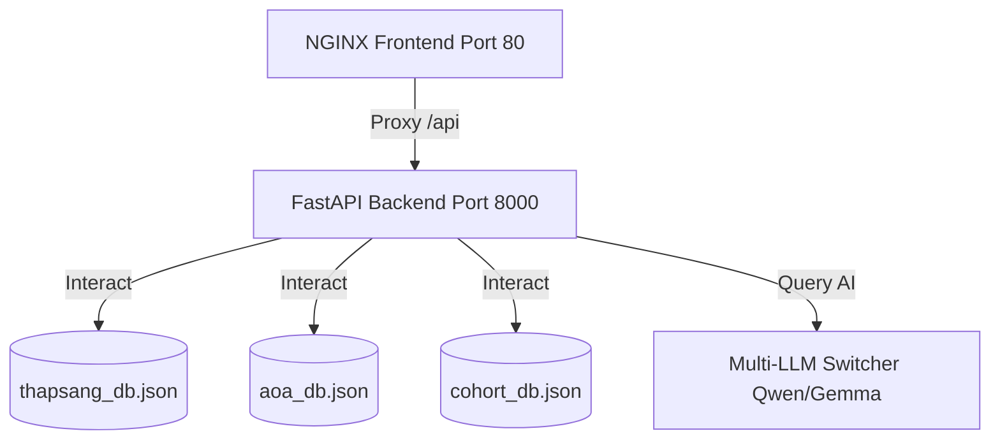

# 🗼 Thapsang Mindset OS (SaaS)

> **Cognitive Rupture & Personal Knowledge Management System**  
> A premium, modular, and AI-driven "Mindset Operating System" designed to trigger cognitive transformation, cultivate Socratic self-reflection, and accelerate structured collaborative learning.

---

## 🌟 Project Metaphor & Core Philosophy

**Thapsang** (meaning *Sparking* or *Illuminating* in Vietnamese) is built upon the **Lighthouse Metaphor**. Rather than offering generic comfort or direct advice, Thapsang acts as a rational, sharp, and objective mirror. Through precise **Socratic Sifting**, it exposes cognitive blind spots, biases, and contradictions, guiding users on an adaptive journey of **Unlearning, Relearning, and Executing**.

---

## 🏗️ High-Fidelity Modular Architecture ("Lighthouse")

Thapsang is constructed using a robust, decoupled microservices model:
1. **Frontend (NGINX + Alpine.js + TailwindCSS):** High-performance static client serving responsive pages, featuring glassmorphism elements, custom smooth transitions, and high-framerate interactive visualizations.
2. **Backend (FastAPI RESTful Engine):** High-throughput Python service driving AI prompt pipelines, state tracking, and secure OTP integrations.
3. **Database Layer (Local JSON DBs):** High-performance, lightweight JSON database schemas serving CRUD operations with absolute local persistence.



---

## 🛠️ Complete Feature Matrix

### 1. 🔑 Authentication & Security
* **Gmail SMTP OTP Engine:** Secure user registration and password recovery flows authenticated via Gmail SMTP 6-digit OTP codes, with an automated fallback to the terminal/console printouts for offline developer debugging.
* **Session Control:** Guarded page paths enforcing cookie-based authentication (`thapsang_session=active`) and `localStorage` token verification.
* **Dynamic Profile Sync:** Bi-directional sync of base64-encoded user avatars, banners, bios, display names, and followers/following states between local storage and backend databases.

### 2. 🧠 AI Socratic Mirror Coach
* **Socratic Sifting Prompting:** System prompts configured to enforce "Socratic mirroring"—guiding users to identify logical inconsistencies themselves through deep inquiry rather than spoon-fed advice.
* **Multi-LLM Switcher:** A dropdown selector allowing users to switch models (`qwen3.5`, `qwen3.6`, `gemma-4`, etc.) on the fly.
* **Dynamic Action Task Extraction:** The AI extracts actionable tasks from conversation histories. New tasks trigger a pulsing red dot indicator over the "Tasks" tab in the sidebar.

### 3. 🗺️ Thapsang Vault & Socratic Diary (Obsocratic PKM)
* **Interactive Markdown Editor:** Full support for Markdown headers, emphasis, lists, and checklists. Users can check/uncheck checkboxes directly in the **Preview Mode**, automatically updating the raw source code.
* **Auto-Creation WikiLinks:** Interactive `[[Page Link]]` syntax. Clicking a non-existent WikiLink automatically generates a new diary page and injects a new node into the Graph View instantly.
* **Fluid Sideways Resizer:** A custom resizer dividing the editor and the graph. It suspends CSS transitions during active dragging for a locked 60fps feel and automatically triggers Vis.js recalculations on mouse release.
* **Obsidian-Style Graph View:** A force-directed knowledge graph (powered by Vis.js) showing connection clusters. Features glowing selection borders, enlarges active nodes, and removes the artificial 'root' node for a natural layout.
* **Focus Mode & Markdown Drawer:** Focus mode hides all distractions, rendering the editor in a full-glassmorphism slate. A drawer handles formatting cheat sheets, easily toggled via a glowing lightbulb button.

### 4. 📋 Todoist-Style Task Manager
* **Column Board Layout:** Intuitive drag-free sorting into "In Progress" and "Completed" columns. Checkbox ticks trigger smooth animations and text line-throughs.
* **Advanced Task Properties:** Supports adding multi-level subtasks, effort scales (1 to 5), and deadlines. Fully synchronized with local cache and `/api/v1/tasks` endpoints.

### 5. 🌐 AOA Feed (Ask Others Anything)
* **Twitter/X-Style Newsfeed:** Lightweight timeline featuring profile information, timestamps, and collapsible panels.
* **Interactive Embedded Mindmaps:** Posts sharing diary nodes render miniature interactive Vis.js graphs right inside the social cards, allowing peers to pan, zoom, and explore connections.
* **Community Interactions:** Social features including follow/unfollow buttons, persistent likes, comments, and quick feed filtering (All Community vs. Personal Footprints).

### 6. 📊 AI Analytics & Cognitive DNA
* **SVG Radar Chart:** A lightweight, responsive SVG radar chart plotting 6 cognitive dimensions: *Data, Big Picture, Emotion, Creativity, Caution, and Optimism*.
* **Mindset DNA Keywords:** Semantic keyword checks scanning chat history and social activity to extract core cognitive strength tags.
* **AI MBTI Profiler:** Prompts AI to analyze user logs and output the top 3 compatible MBTI profiles, matching percentages, and developmental advice.
* **No-Leak Auto-Closing Toast:** Replaces buggy HTML popups with a beautiful, clean submission success toast that auto-dismisses after 2 seconds (`closeSubmission`).

### 7. 🔥 Cohort-Based Path (Collaborative Learning)
* **3-Phase Syllabus Cards:** Beautiful unlearn-relearn-execute curriculums tracking peer performance.
* **Cohort Progress Heatmap:** Visual grid representing progress across the cohort. The active user is highlighted with a gold-bordered glowing cell (`.heatmap-cell-self.pulse-gold`), while peers display grades of emerald green.
* **Interactive Accountability Buddy Peer Review:**
  * Weekly pairing mechanics with chosen cohort buddies.
  * **Slide-out Review Panel:** A sliding modal on the right displays all buddy tasks (Core and Supplementary).
  * **5-Star Rating & Comments:** Custom star ratings with descriptive feedback states (*Chưa đạt, Cần cải thiện, Đạt yêu cầu, Tốt, Xuất sắc*) and text feedback.
  * **Live Resonance Feed:** Syncs cohort achievements, updates peer-review markers, and outputs gold-bordered event notices on the timeline feed.
* **Dynamic Pivot:** Detects cohort-wide learning bottlenecks and suggests supplementary tasks that users can add to their Todoist boards with a single click.
* **Mind Map Evolution:** Curved, glowing SVG paths displaying the transition of cohort cognitive development from *Unlearn* (red dashed nodes) to *Relearn* (pulsing emerald nodes) with flowing dash-array animations.

---

## 📂 Directory Structure

```text
📦 thapsang
 ┣ 📂 backend                  # FastAPI Web Server Engine
 ┃ ┣ 📂 __pycache__            # Python compiled caches
 ┃ ┣ 📜 main.py                # Core REST API Router & Server
 ┃ ┣ 📜 mindset_analyzer.py    # AI psychological engine (MBTI, 6-Dimension)
 ┃ ┣ 📜 requirements.txt       # Python environment dependencies
 ┃ ┣ 📜 test_api.py            # Automated API Integration Test Suite
 ┃ ┗ 📜 user_profile.py        # Profile stats analyzer & SVG chart generator
 ┣ 📂 database                 # Persistent JSON Database Layers
 ┃ ┣ 📜 aoa_db.json            # Social feeds, comments, and graph schemas
 ┃ ┣ 📜 cohort_db.json         # Cohort syllabus, buddy reviews, and heatmap stats
 ┃ ┗ 📜 thapsang_db.json       # User credentials, profiles, and Socratic chat logs
 ┣ 📂 docs                     # System Documentation
 ┃ ┣ 📂 images                 # Captured high-fidelity interface screenshots
 ┃ ┣ 📜 PROJECT_CHECKLIST.md   # Master Project Feature Checklist (Vietnamese)
 ┃ ┣ 📜 README.md              # Project overview (this document)
 ┃ ┣ 📜 TEST_SCENARIOS.md      # Comprehensive manual & QA test cases (Vietnamese)
 ┃ ┗ 📜 USER_MANUAL.md         # Comprehensive user step-by-step walkthrough (Vietnamese)
 ┣ 📂 frontend                 # Modular "Lighthouse" Web Client
 ┃ ┣ 📜 analytics.html         # Cognitive analysis & MBTI dashboard
 ┃ ┣ 📜 aoa.html               # Ask Others Anything social newsfeed
 ┃ ┣ 📜 coach.html             # Socratic AI Coach chat interface
 ┃ ┣ 📜 cohort.html            # Cohort-based group learning path
 ┃ ┣ 📜 diary.html             # Obsocratic PKM & Obsidian graph view editor
 ┃ ┣ 📜 index.css              # Core styling system (animations, scrollbars)
 ┃ ┣ 📜 login.html             # Modern login, registration, and OTP interface
 ┃ ┣ 📜 nginx.conf             # NGINX proxy & static file server configurations
 ┃ ┗ 📜 tasks.html             # Todoist-style task manager board
 ┣ 📜 .dockerignore            # Docker ignore file
 ┣ 📜 .gitignore               # Git versioning exclusion rules
 ┣ 📜 Dockerfile               # Multi-stage container packaging configuration
 ┗ 📜 docker-compose.yml       # Production-ready orchestration manifest
```

---

## 🛠️ Local Installation & Development Setup

### Option 1: Quick Start with Docker Compose (Recommended)
1. **Configure Environment Variables:**
   Create a `.env` file in the `backend/` directory:
   ```env
   OPENAI_API_KEY=your_openai_or_compatible_api_key
   OPENAI_BASE_URL=https://api.openai.com/v1  # Or your custom LLM endpoint
   ```
2. **Launch the Container Stack:**
   ```bash
   docker-compose up --build -d
   ```
3. **Enjoy the App:**
   Open your browser and navigate to `http://localhost/` (Default NGINX Port 80).

---

### Option 2: Native Manual Run
#### 1. Start the FastAPI Backend:
Ensure Python 3.10+ is installed.
```bash
cd backend
python -m venv venv
# Activate venv:
# Windows:
.\venv\Scripts\activate
# Unix/macOS:
source venv/bin/activate

pip install -r requirements.txt
python main.py
```
*Backend runs on `http://127.0.0.1:8000`.*

#### 2. Serve the Frontend:
Copy or proxy the static files using NGINX, or simply run a lightweight web server in the `frontend/` directory (e.g. `npx serve`, Python `http.server`, or Live Server extension). If running locally, make sure you configure your proxy or NGINX configurations (`frontend/nginx.conf`) to redirect `/api/` requests to `http://localhost:8000`.

---

## 🤖 Running Automated Integration Tests

To run the automated, zero-footprint test suite:
1. Open your terminal in the workspace root.
2. Run the test script using `utf-8` encoding to prevent Windows CLI encodings errors:
   ```powershell
   $env:PYTHONIOENCODING="utf-8"; python backend/test_api.py
   ```
3. The test engine will:
   - Create local backup copies (`*.json.bak`) of your live databases.
   - Run 6 comprehensive integration tests against the FastAPI endpoints.
   - Clean up and restore your exact databases, leaving zero footprint.

---
*Developed with ❤️ by INNORIA*
