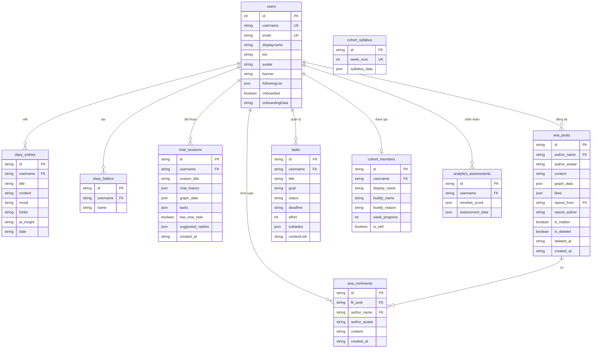

# Tài liệu Thiết kế Cơ sở Dữ liệu - Thapsang Mindset OS

Tài liệu này mô tả chi tiết cấu trúc cơ sở dữ liệu, các bảng dữ liệu (Collections), cấu trúc trường (Fields) và sơ đồ quan hệ (Entity Relationship Diagram - ERD) của hệ thống **Thapsang Mindset OS**. Toàn bộ dữ liệu được lưu trữ, đồng bộ và quản lý thời gian thực thông qua dịch vụ **Mojo CMS API**.

---

## 1. Sơ đồ Quan hệ Cơ sở Dữ liệu (Entity Relationship Diagram)

Sơ đồ dưới đây minh họa các mối quan hệ và liên kết giữa các bảng trong hệ thống:

---

## 2. Chi tiết các Bảng dữ liệu (Collections)

Hệ thống Thapsang OS quản lý **10 bảng chính** (bao gồm các bảng mặc định của hệ thống quản lý người dùng và các bảng nghiệp vụ tùy biến).

### 2.1 Bảng `users` (Quản lý Người dùng)
Lưu trữ thông tin tài khoản, hồ sơ cá nhân và trạng thái/dữ liệu trả lời bảng hỏi onboarding ban đầu.

| Tên trường | Kiểu dữ liệu | Đặc điểm | Mô tả |
| :--- | :--- | :--- | :--- |
| `id` | Integer | Primary Key | ID tự tăng sinh bởi hệ thống CMS. |
| `username` | String | Unique Key | Tên đăng nhập duy nhất của người dùng. |
| `email` | String | Unique Key | Địa chỉ email dùng để đăng ký, đăng nhập & OTP. |
| `phone` | String | Nullable | Số điện thoại (tùy chọn). |
| `password` | String | Hashed | Mật khẩu tài khoản đã mã hóa một chiều. |
| `displayname` | String | Nullable | Tên hiển thị công khai trên mạng xã hội AOA. |
| `bio` | String | Nullable | Lời tự giới thiệu ngắn về bản thân. |
| `avatar` | String | Nullable | URL ảnh đại diện của người dùng. |
| `banner` | String | Nullable | URL ảnh bìa trang cá nhân. |
| `followingList` | JSON Array | Default `[]` | Mảng chứa danh sách `username` của những người đang theo dõi. |
| `onboarded` | Boolean | Default `false` | Đánh dấu người dùng đã hoàn thành các bước onboarding hay chưa. |
| `onboardingData` | String (Chữ trần) | Nullable | Chuỗi phẳng ghi nhận ngày sinh, sở thích, mục tiêu, nguồn và bối cảnh AI (Không chứa JSON, cực kỳ trực quan cho Admin). |

---

### 2.2 Bảng `diary_entries` (Ghi chép Nhật ký)
Lưu trữ các ghi chép tự sự (Reflection Journaling) của người dùng và các câu hỏi soi chiếu/nhận thức sinh từ AI Coach.

| Tên trường | Kiểu dữ liệu | Đặc điểm | Mô tả |
| :--- | :--- | :--- | :--- |
| `id` | String | Primary Key | ID dạng chuỗi (Snowflake). |
| `username` | String | Foreign Key | Liên kết với `users.username` để xác định chủ sở hữu. |
| `title` | String | Required | Tiêu đề của bài viết nhật ký. |
| `content` | String | LongText | Nội dung chi tiết các suy ngẫm sâu sắc của người dùng. |
| `mood` | String | Default `"Calm"` | Trạng thái cảm xúc tại thời điểm viết (Calm, Stressed, Anxious, v.v.). |
| `folder` | String | Nullable | Tên thư mục chứa ghi chép (nếu có liên kết). |
| `ai_insight` | String | LongText | Phản hồi phản tỉnh độc quyền sinh bởi AI Socratic Coach giúp soi chiếu nhận thức. |
| `date` | String | Timestamp | Thời điểm tạo nhật ký dạng `YYYY-MM-DD HH:MM:SS`. |

---

### 2.3 Bảng `diary_folders` (Thư mục Nhật ký)
Hỗ trợ tổ chức sắp xếp tài liệu nhật ký theo cấu trúc thư mục (Vault) của người dùng.

| Tên trường | Kiểu dữ liệu | Đặc điểm | Mô tả |
| :--- | :--- | :--- | :--- |
| `id` | String | Primary Key | ID dạng chuỗi (Snowflake). |
| `username` | String | Foreign Key | Liên kết với `users.username`. |
| `name` | String | Required | Tên thư mục không được trùng lặp đối với cùng một người dùng. |

---

### 2.4 Bảng `chat_sessions` (Phiên Đối thoại Socratic)
Lưu trữ đầy đủ các phiên trò chuyện, sơ đồ nhận thức Hải đăng (Mind Map) tích lũy và đề xuất Socratic tương tác.

| Tên trường | Kiểu dữ liệu | Đặc điểm | Mô tả |
| :--- | :--- | :--- | :--- |
| `id` | String | Primary Key | ID phiên đối thoại (Snowflake hoặc chuỗi sinh ngẫu nhiên). |
| `username` | String | Foreign Key | Liên kết với `users.username`. |
| `custom_title` | String | Nullable | Tiêu đề tùy biến của cuộc hội thoại (do người dùng đặt hoặc sinh tự động từ 5-7 từ đầu của AI). |
| `chat_history` | JSON Array | Required | Lịch sử chat: `[{"role": "user" \| "model", "content": "...", "reasoning": "...", "title": "...", "isWelcome": bool}]`. |
| `graph_data` | JSON Object | Required | Chứa cấu trúc mạng lưới nút (nodes) và cạnh (edges) của Mindmap nhận thức. |
| `tasks` | JSON Array | Default `[]` | Mảng chứa các nhiệm vụ hành động thực tế do AI giao sau mỗi 5 lượt đối thoại. |
| `has_new_task` | Boolean | Default `false` | Đánh dấu phiên trò chuyện có nhiệm vụ mới chưa xem. |
| `suggested_replies` | JSON Array | Default `[]` | Mảng chứa 3 câu trả lời gợi ý sinh bởi AI phù hợp với ngữ cảnh hiện tại. |
| `created_at` | String | Timestamp | Ngày giờ khởi tạo phiên trò chuyện. |

---

### 2.5 Bảng `aoa_posts` (Bài đăng Mạng Xã hội AOA)
Lưu trữ các bài chia sẻ công khai của cộng đồng Thapsang, cho phép chia sẻ các sơ đồ tư duy (Mental Topography) và suy ngẫm cá nhân.

| Tên trường | Kiểu dữ liệu | Đặc điểm | Mô tả |
| :--- | :--- | :--- | :--- |
| `id` | String | Primary Key | ID bài đăng duy nhất. |
| `author_name` | String | Foreign Key | Liên kết với `users.username`. |
| `author_avatar` | String | Nullable | Ảnh đại diện của tác giả tại thời điểm đăng bài (để cache truy xuất nhanh). |
| `content` | String | LongText | Nội dung bài đăng (hỗ trợ định dạng hashtags). |
| `graph_data` | JSON Object | Nullable | Sơ đồ tư duy đính kèm được chia sẻ trực quan trên bảng tin. |
| `likes` | JSON Array | Default `[]` | Danh sách mảng chứa `username` những người đã nhấn thích bài đăng này. |
| `repost_from` | String | Foreign Key | ID của bài đăng gốc (nếu là hành động repost chia sẻ lại bài viết của người khác). |
| `repost_author` | String | Nullable | Tên tác giả bài viết gốc (nếu là bài repost). |
| `is_hidden` | Boolean | Default `false` | Trạng thái ẩn bài viết (người dùng tự ẩn khỏi bảng tin của mình). |
| `is_deleted` | Boolean | Default `false` | Trạng thái xóa bài viết (chuyển vào thùng rác). |
| `deleted_at` | String | Nullable | Thời điểm đưa vào thùng rác (sẽ tự động xóa vĩnh viễn sau 30 ngày). |
| `created_at` | String | Timestamp | Thời điểm đăng bài viết. |

---

### 2.6 Bảng `aoa_comments` (Bình luận AOA)
Lưu trữ các bình luận trao đổi, góp ý của người dùng trên mỗi bài đăng AOA công khai.

| Tên trường | Kiểu dữ liệu | Đặc điểm | Mô tả |
| :--- | :--- | :--- | :--- |
| `id` | String | Primary Key | ID bình luận duy nhất. |
| `fk_post` | String | Foreign Key | ID bài đăng gốc liên kết đến bảng `aoa_posts.id`. |
| `author_name` | String | Foreign Key | Liên kết với `users.username` người viết bình luận. |
| `author_avatar` | String | Nullable | Ảnh đại diện của người bình luận. |
| `content` | String | Required | Nội dung văn bản bình luận. |
| `created_at` | String | Timestamp | Thời điểm gửi bình luận. |

---

### 2.7 Bảng `tasks` (Quản lý Nhiệm vụ Cá nhân)
Lưu trữ các hành động thực tế (actionable tasks) được AI sinh ra để giúp người dùng tháo gỡ các rào cản nhận thức, kết hợp quản lý theo chu trình PDCA.

| Tên trường | Kiểu dữ liệu | Đặc điểm | Mô tả |
| :--- | :--- | :--- | :--- |
| `id` | String | Primary Key | ID nhiệm vụ. |
| `username` | String | Foreign Key | Liên kết với `users.username`. |
| `title` | String | Required | Tên công việc hoặc hành động cần làm. |
| `goal` | String | LongText | Hướng dẫn chi tiết cách thực hiện nhiệm vụ và mục tiêu chuyển hóa tư duy. |
| `status` | String | Default `"backlog"` | Trạng thái nhiệm vụ: `backlog`, `in_progress`, `done`, hoặc `trash`. |
| `deadline` | String | Nullable | Hạn chót hoàn thành nhiệm vụ. |
| `effort` | Integer | Default `1` | Điểm độ khó / nỗ lực yêu cầu thực hiện (1 đến 5). |
| `subtasks` | JSON Array | Default `[]` | Mảng danh sách các đầu mục con: `[{"title": "...", "completed": bool}]`. |
| `contextLink` | String | Nullable | Nhãn liên kết ngữ cảnh (ví dụ: `"Personal Roadmap"` nếu nhiệm vụ thuộc lộ trình giáo trình tuần). |

---

### 2.8 Bảng `cohort_members` (Thành viên Lộ trình Học tập)
Quản lý trạng thái tham gia, người đồng hành và tiến độ hoàn thành mục tiêu tuần của người dùng trên Lộ trình cá nhân.

| Tên trường | Kiểu dữ liệu | Đặc điểm | Mô tả |
| :--- | :--- | :--- | :--- |
| `id` | String | Primary Key | ID thành viên. |
| `username` | String | Foreign Key | Liên kết với `users.username`. |
| `display_name` | String | Nullable | Tên hiển thị người dùng (displayName). |
| `buddy_name` | String | Default `"Gia Cát AI"` | Tên của người đồng hành định hướng / bạn đồng hành học tập. |
| `buddy_reason` | String | LongText | Định hướng phát triển và lý do thiết lập lộ trình cho cá nhân này. |
| `week_progress` | Integer | Default `0` | Phần trăm hoàn thành các nhiệm vụ tuần (0 - 100%). |
| `is_self` | Boolean | Default `true` | Xác định thành viên này chính là bản thân tài khoản đang đăng nhập. |

---

### 2.9 Bảng `cohort_syllabus` (Giáo trình Lộ trình Tuần)
Lưu trữ khung nội dung và bộ các nhiệm vụ cốt lõi, nhiệm vụ phụ trợ được cấu hình sẵn cho chương trình tái tạo tư duy 12 tuần (Đại Kiến Thiết).

| Tên trường | Kiểu dữ liệu | Đặc điểm | Mô tả |
| :--- | :--- | :--- | :--- |
| `id` | String | Primary Key | ID giáo trình. |
| `week_num` | Integer | Unique Key | Thứ tự tuần trong lộ trình học tập (Ví dụ: Tuần 1 đến Tuần 12). |
| `syllabus_data` | JSON Object | Required | Khung chương trình chi tiết của tuần bao gồm các nhiệm vụ học tập, tài liệu đọc và nhiệm vụ thực hành PDCA. |

---

### 2.10 Bảng `analytics_assessments` (Đánh giá & Chẩn đoán Định kỳ)
Lưu trữ kết quả các bài chẩn đoán nhận thức và chỉ số tư duy đa chiều định kỳ giúp vẽ đồ thị radar chỉ số DNA Mindset của người dùng.

| Tên trường | Kiểu dữ liệu | Đặc điểm | Mô tả |
| :--- | :--- | :--- | :--- |
| `id` | String | Primary Key | ID bản ghi. |
| `username` | String | Foreign Key | Liên kết với `users.username`. |
| `mindset_score` | JSON Object | Required | Điểm số các chiều nhận thức: `Caution`, `Emotions`, `Creativity`, `Mindfulness`, `Optimism`, `Focus`. |
| `assessment_data` | JSON Object | Required | Chứa danh sách chi tiết các câu trả lời đầy đủ của người dùng đối với bài trắc nghiệm soi chiếu. |

---

## 3. Bản đồ Thiết kế Khóa ngoại & Ràng buộc Liên kết (Foreign Key Integrity)

Hệ thống Thapsang OS được thiết kế theo mô hình **Sơ đồ ngôi sao hội tụ quanh người dùng (User-Centric Architecture)**. 

1. **Khóa liên kết hạt nhân (`username`):** 
   Hầu hết tất cả các bảng nghiệp vụ (`diary_entries`, `diary_folders`, `chat_sessions`, `aoa_posts`, `tasks`, `cohort_members`, `analytics_assessments`) đều liên kết trực tiếp với trường `username` độc nhất trong bảng `users` thay vì liên kết qua ID số. Thiết kế này giúp tối ưu hóa việc phân tích nhanh và tổng hợp trực tiếp bối cảnh Core Context trên toàn hệ thống thời gian thực.
2. **Khóa bình luận (`fk_post`):**
   Mối quan hệ 1-Nhiều (1-to-Many) giữa `aoa_posts` và `aoa_comments` được bảo toàn thông qua liên kết `fk_post` trỏ thẳng tới `id` của bài đăng gốc. Khi một bài đăng gốc bị xóa vĩnh viễn, hệ thống sẽ thực hiện thao tác xóa dây chuyền (Cascade Delete) toàn bộ bình luận liên quan để giữ sạch dữ liệu.
3. **Mối nối Repost (`repost_from`):**
   Mạng xã hội AOA hỗ trợ chức năng Repost/Share thông qua mối nối khóa ngoại tự tham chiếu `repost_from` trong bảng `aoa_posts`. Một bài đăng có `repost_from` khác null sẽ trỏ tới ID của bài đăng AOA gốc trong cùng một bảng.
